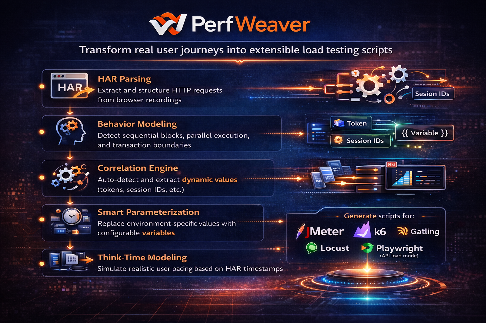

<p align="center">
  
</p>
<h1 align="center">PerfWeaver</h1>
<p align="center">
  Weaving real traffic into performance tests
</p>

<p align="center">
  <a href="https://github.com/ashwin-ak/perfweaver">
    
  </a>
  <a href="https://github.com/ashwin-ak/perfweaver/LICENSE">
    
  </a>
  <a href="https://www.npmjs.com/package/perfweaver">
    
  </a>
</p>

Convert browser HAR (HTTP Archive) traffic into structured load-testing scripts for multiple performance testing tools.



## Features

- **HAR Parsing**: Extract and structure HTTP requests from browser recordings
- **Behavior Modeling**: Detect sequential blocks, parallel execution, and transaction boundaries
- **Correlation Engine**: Auto-detect and extract dynamic values (tokens, session IDs, etc.)
- **Smart Parameterization**: Replace environment-specific values with configurable variables
- **Think-Time Modeling**: Simulate realistic user pacing based on HAR timestamps
- **Multi-Tool Support**: Generate scripts for:
  - Apache JMeter
  - k6
  - Gatling
  - Locust
  - Playwright (API load mode)

## Architecture

The system uses a layered architecture to ensure extensibility:

```
HAR Input
    ↓
HAR Parsing Engine
    ↓
Behavior Modeling Engine
    ↓
Correlation Engine
    ↓
Parameterization Engine
    ↓
Tool Adapters
    ↓
Generated Load Test Scripts
```

## Installation

Install from npm:

```bash
npm install perfweaver
```

You can also use it via npx without installation:

```bash
npx perfweaver analyze example.har
```

For development:

```bash
git clone https://github.com/ashwin-ak/perfweaver.git
cd perfweaver
npm install
npm run build
```

Or for development:

```bash
git clone <repo>
cd perfweaver
npm install
npm run build
```

## Quick Start

### Generate a JMeter Script

```bash
perfweaver generate --tool jmeter --har login.har --output login.jmx
```

### Generate a k6 Script

```bash
perfweaver generate --tool k6 --har checkout.har --output checkout.js
```

### Analyze HAR File

```bash
perfweaver analyze login.har
```

### Visualize HAR Structure

```bash
perfweaver visualize login.har --output report.html
```

## Configuration

Create a `perfweaver.config.yaml` in your project root:

```yaml
filters:
  ignoreExtensions:
    - png
    - jpg
    - gif
    - css
    - woff
    - woff2
    - ttf
    - svg
  ignoreResourceTypes:
    - image
    - stylesheet
    - font
    - media

parallelDetection:
  overlapThresholdMs: 40

correlation:
  enableAutoCorrelation: true
  extractors:
    - type: json
    - type: regex
    - type: xpath

parameterization:
  envVars:
    - BASE_URL
    - AUTH_TOKEN
    - USER_ID

loadModel:
  threadCount: 10
  rampUpTime: 60
  duration: 300
  iterations: 1

tools:
  enabled:
    - jmeter
    - k6
    - gatling
```

## Module Structure

- **core/har-parser**: Parse and extract HAR data
- **core/behavior-model**: Detect transactions and request relationships
- **core/correlation-engine**: Auto-detect dynamic values
- **core/parameterization**: Replace values with variables
- **core/think-time**: Model user pacing
- **core/load-model**: Configure load profiles
- **adapters/**: Tool-specific script generators
- **cli/**: Command-line interface
- **tests/**: Unit and integration tests

## Usage Examples

See the [examples](./examples) directory for sample HAR files and generated scripts.

## Documentation

Complete user and developer guides are available in the `docs/` folder:

- [Quick Start](docs/QUICKSTART.md)
- [API & CLI Reference](docs/DOCUMENTATION.md)
- [Performance Tuning](docs/PERFORMANCE_TUNING.md)
- [Developer Guide](docs/DEVELOPMENT.md)
- [Architecture Overview](docs/ARCHITECTURE.md)

## Contributing

Contributions are welcome! Please follow the coding standards and add tests for new features.

## License

MIT

## Author

Ashwin Kulkarni
